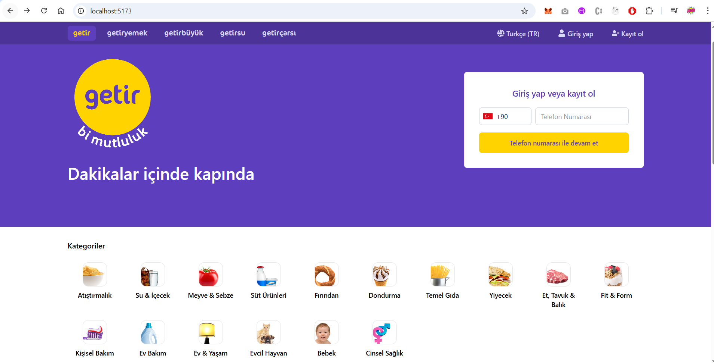
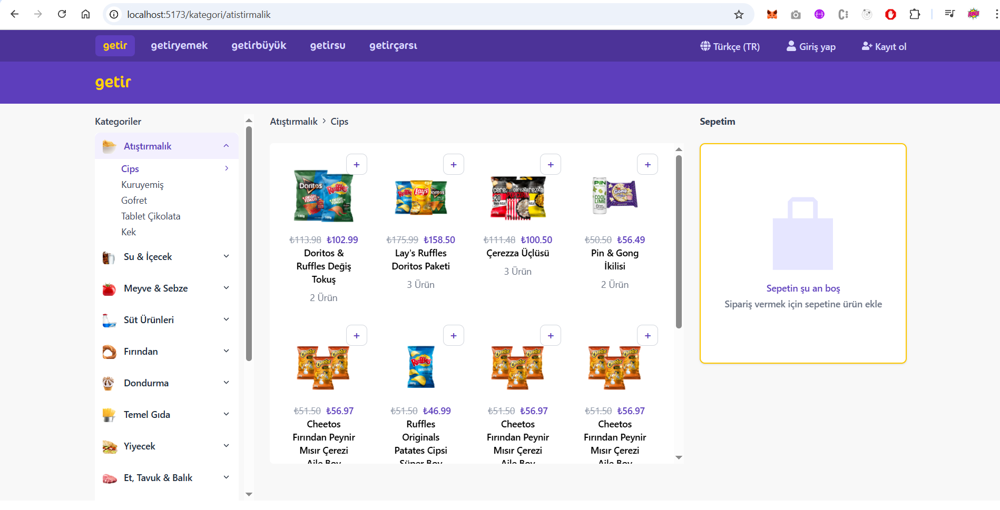

# 🛒 Getir Clone – Frontend

This is the **React-based frontend** of the Getir Clone project. It replicates the UI/UX of the original Getir app and connects to a [Spring Boot microservices backend](https://github.com/sirdashasan/getir-clone-backend). The design is fully responsive and optimized for both desktop and mobile users.

## 🖼 Screenshots

### 🏠 Home Page



### 🗂 Category Page



## 🚀 Features

- 🧭 **Routing with React Router**
  - Home page, category listing, and dynamic product detail pages
- 📱 **Responsive UI**
  - Tailwind CSS used to replicate Getir’s mobile-first layout
- 🔍 **Category & Product System**
  - Dynamic fetch of categories and subcategories
  - Product filtering and display per category
- 🧾 **Product Detail Page**
  - Displays image, price, old price, ingredients, and additional info
- 🌐 **Language Selection Popup**
  - Multilingual support via manual toggle
- 🛒 **Cart System** *(in progress)*  
  - Add/remove items, quantity adjustments
- 📦 **State Management with Context API**


## 🛠️ Tech Stack
- **Frontend**: React, Tailwind CSS, React Router DOM, Context API, Axios

## 📦 Installation & Running

```bash
# 1. Clone the repository
git clone https://github.com/sirdashasan/getir-clone.git

# 2. Navigate to the frontend directory
cd getir-clone

# 3. Install dependencies
npm install

# 4. Run the development server
npm run dev
```